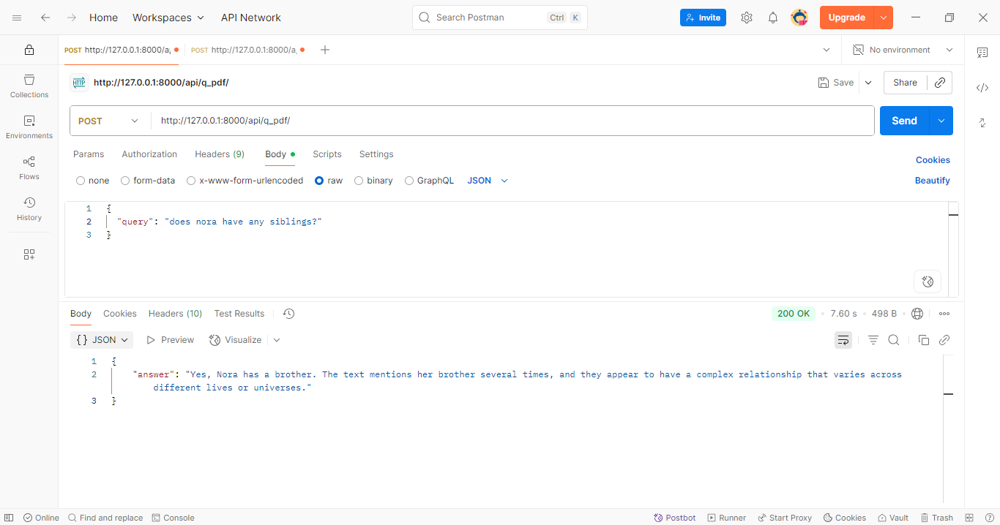

## Retrieval-Augmented Generation (RAG) Project
This is a personal Retrieval-Augmented Generation (RAG) project that combines document retrieval with a large language model to answer user queries based on uploaded documents.
It is designed to let you upload PDFs and then query their contents with natural language.


# Features
 PDF Upload – Upload one or multiple PDF files for processing

 Context-Aware Search – Retrieve relevant text chunks using a vector database

 LLM Integration – Use a language model to generate responses grounded in retrieved content

 API-First – Access via REST endpoints

  ## Tech Stack
  Backend Framework: Django

  Vector Store: FAISS

  Embedding Model: HuggingFace embeddings

  LLM: langchain-groq

  File Handling: PyMuPDF
    
 

```
rag_ai/
├── api
│ ├── models.py 
│ ├── views.py 
│ ├── urls.py 
│ ├── serializers.py
│ ├── services.py                # upload, chunk and embed
│ └── ...
├── text_moderation/           # Main Django project configuration
│ ├── settings.py 
│ ├── urls.py 
│ └── ...
├── manage.py 
├── requirements.txt # Python dependencies
└── README.md 

```

## Installation
1. Clone the repository

  
2. Install a virtual environment:
```sh
pip install virtualenv
```
3. Create a virtual environment and activate it:
```sh
py -m venv myenv

myenv/scripts/activate
 ```
`myenv` is the name of the environment folder.

Install dependencies:
```sh
py -m pip install -r requirements.txt
```
Make initial migrations:
```bash
python manage.py makemigrations

python manage.py migrate
```
Start the backend development server:
```bash
python manage.py runserver
```

## Usage

1. Start the backend development server:
```bash
python manage.py runserver
```
2. Upload a PDF
   Send a POST request to ```http://127.0.0.1:8000/api/upload_pdf/``` with the file.
3. Query the document
  Send a POST request to ```http://127.0.0.1:8000/api/query_pdf/``` with your question.

Example 1 — Asked about the main character


Example 2 — Asked a follow-up about the character’s sibling



Example 3 — Asked a random  question


This RAG system includes a relevance check to ensure that answers are based only on the provided documents.This prevents hallucinations (made-up answers) and ensures that users can trust the output when it does provide an answer.


